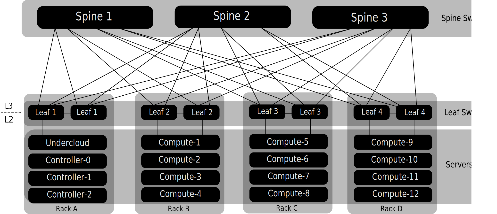

.. _routed_spine_leaf_network:

Deploying Overcloud with L3 routed networking
=============================================

Layer 3 Routed spine and leaf architectures is gaining in popularity due to the
benefits, such as high-performance, increased scalability and reduced failure
domains.

The below diagram is an example L3 routed
`Clos <https://en.wikipedia.org/wiki/Clos_network>`_ architecture. In this
example each server is connected to top-of-rack leaf switches. Each leaf switch
is attached to each spine switch. Within each rack, all servers share a layer 2
domain. The layer 2 network segments are local to the rack. Layer 3 routing via
the spine switches permits East-West traffic between the racks:

.. Note:: Typically Dynamic Routing is implemented in such an architecture.
          Often also
          `ECMP <https://en.wikipedia.org/wiki/Equal-cost_multi-path_routing>`_
          (Equal-cost multi-path routing) and
          `BFD <https://en.wikipedia.org/wiki/Bidirectional_Forwarding_Detection>`_
          (Bidirectional Forwarding Detection) are used to provide non-blocking
          forwarding and fast convergence times in case of failures.
          Configuration of the underlying network architecture is not in the
          scope of this document.

Layer 3 routed Requirements
---------------------------

For TripleO to deploy the ``overcloud`` on a network with a layer 3 routed
architecture the following requirements must be met:

* **Layer 3 routing**:
  The network infrastructure must have *routing* configured to enable traffic
  between the different layer 2 segments. This can be statically or dynamically
  configured.

* **DHCP-Relay**:
  Each layer 2 segment that is not local to the ``undercloud`` must provide
  *dhcp-relay*. DHCP requests must be forwarded to the Undercloud on the
  provisioning network segment where the ``undercloud`` is connected.

  .. Note:: The ``undercloud`` uses two DHCP servers. One for baremetal node
            introspection, and another for deploying overcloud nodes.

            Make sure to read `DHCP relay configuration`_ to understand the
            requirements when configuring *dhcp-relay*.

Layer 3 routed Limitations
--------------------------

* Some roles, such as the Controller role, use virtual IP addresses and
  clustering. The mechanism behind this functionality requires layer-2 network
  connectivity between these nodes. These nodes must all be placed within the
  same leaf.

* Similar restrictions apply to networker nodes. The Network service implements
  highly-available default paths in the network using Virtual Router Redundancy
  Protocol (VRRP). Since VRRP uses a virtual router ip address, master and
  backup nodes must be connected to the same L2 network segment.

* When using tenant or provider networks with VLAN segmentation, the particular
  VLANs used must be shared between all networker and compute nodes.

  .. Note:: It is possible to configure the Network service with multiple sets
            of networker nodes. Each set would share routes for their networks,
            and VRRP would be used within each set of networker nodes to
            provide highly-available default paths. In such configuration all
            networker nodes sharing networks must be on the same L2 network
            segment.

Create undercloud configuration
-------------------------------

To deploy the ``overcloud`` on a L3 routed architecture the ``undercloud``
needs to be configured with multiple neutron network segments and subnets on
the ``ctlplane`` network.

#. In the ``[DEFAULT]`` section of ``undercloud.conf`` enable the routed
   networks feature by setting ``enable_routed_networks`` to ``true``. For
   example::

     enable_routed_networks = true

#. In the ``[DEFAULT]`` section of ``undercloud.conf`` add a comma separated
   list of control plane subnets. Define one subnet for each layer 2 segment in
   the routed spine and leaf. For example::

     subnets = leaf0,leaf1,leaf2

#. In the ``[DEFAULT]`` section of ``undercloud.conf`` specify the subnet that
   is associated with the physical layer 2 segment that is *local* to the
   ``undercloud``. For example::

     local_subnet = leaf0

#. For each of the control plane subnets specified in ``[DEFAULT]\subnets``
   add an additional section in ``undercloud.conf``, for example::

     [leaf0]
     cidr = 192.168.10.0/24
     dhcp_start = 192.168.10.10
     dhcp_end = 192.168.10.90
     inspection_iprange = 192.168.10.100,192.168.10.190
     gateway = 192.168.10.1
     masquerade = False

     [leaf1]
     cidr = 192.168.11.0/24
     dhcp_start = 192.168.11.10
     dhcp_end = 192.168.11.90
     inspection_iprange = 192.168.11.100,192.168.11.190
     gateway = 192.168.11.1
     masquerade = False

     [leaf2]
     cidr = 192.168.12.0/24
     dhcp_start = 192.168.12.10
     dhcp_end = 192.168.12.90
     inspection_iprange = 192.168.12.100,192.168.12.190
     gateway = 192.168.12.1
     masquerade = False

Install the undercloud
----------------------

Once the ``undercloud.conf`` is updated with the desired configuration, install
the undercloud by running the following command::

  $ openstack undercloud install

Once the ``undercloud`` is installed complete the post-install tasks such as
uploading images and registering baremetal nodes. (For addition details
regarding the post-install tasks, see
:doc:`../deployment/install_overcloud`.)

DHCP relay configuration
------------------------

The TripleO Undercloud uses two DHCP servers on the provisioning network, one
for ``introspection`` and another one for ``provisioning``. When configuring
*dhcp-relay* make sure that DHCP requests are forwarded to both DHCP servers on
the Undercloud.

For devices that support it, UDP *broadcast* can be used to relay DHCP requests
to the L2 network segment where the Undercloud provisioning network is
connected. Alternatively UDP *unicast* can be can be used, in this case DHCP
requests are relayed to specific ip addresses.

.. Note:: Configuration of *dhcp-relay* on specific devices types is beyond the
          scope of this document. As a reference
          `DHCP relay configuration (Example)`_ using the implementation in
          `ISC DHCP software <https://www.isc.org/downloads/dhcp/>`_ is
          available below. (Please refer to manual page
          `dhcrelay(8) <https://linux.die.net/man/8/dhcrelay>`_ for further
          details on how to use this implementation.)

Broadcast DHCP relay
~~~~~~~~~~~~~~~~~~~~

DHCP requests are relayed onto the L2 network segment where the DHCP server(s)
reside using UDP *broadcast* traffic. All devices on the network segment will
receive the broadcast traffic. When using UDP *broadcast* both DHCP servers on
the Undercloud will receive the relayed DHCP request.

Depending on implementation this is typically configured by specifying either
*interface* or *ip network address*:

* **Interface**:
  Specifying an interface connected to the L2 network segment where the DHCP
  requests will be relayed.
* **IP network address**:
  Specifying the network address of the IP network where the DHCP request will
  be relayed.

Unicast DHCP relay
~~~~~~~~~~~~~~~~~~

DHCP requests are relayed to specific DHCP servers using UDP *unicast* traffic.
When using UDP *unicast* the device configured to provide *dhcp-relay* must be
configured to relay DHCP requests to both the IP address assigned to the
interface used for *introspection* on the Undercloud and the IP address of the
network namespace created by the Network service to host the DHCP service for
the ``ctlplane`` network.

The interface used for *introspection* is the one defined as
``inspection_interface`` in ``undercloud.conf``.

.. Note:: It is common to use the ``br-ctlplane`` interface for introspection,
          the IP address defined as ``local_ip`` in ``undercloud.conf`` will be
          on the ``br-ctlplane`` interface.

The IP address allocated to the neutron DHCP namespace will typically be the
first address available in the IP range configured for the ``local_subnet`` in
``undercloud.conf``. (The first address in the IP range is the one defined as
``dhcp_start`` in the configuration.) For example: ``172.20.0.10`` would be the
IP address when the following configuration is used::

  [DEFAULT]
  local_subnet = leaf0
  subnets = leaf0,leaf1,leaf2

  [leaf0]
  cidr = 172.20.0.0/26
  dhcp_start = 172.20.0.10
  dhcp_end = 172.20.0.19
  inspection_iprange = 172.20.0.20,172.20.0.29
  gateway = 172.20.0.62
  masquerade = False

.. Warning:: The IP address for the DHCP namespace is automatically allocated,
             it will in most cases be the first address in the IP range, but
             do make sure to verify that this is the case by running the
             following commands on the Undercloud::

               $ openstack port list --device-owner network:dhcp -c "Fixed IP Addresses"
               +----------------------------------------------------------------------------+
               | Fixed IP Addresses                                                         |
               +----------------------------------------------------------------------------+
               | ip_address='172.20.0.10', subnet_id='7526fbe3-f52a-4b39-a828-ec59f4ed12b2' |
               +----------------------------------------------------------------------------+
               $ openstack subnet show 7526fbe3-f52a-4b39-a828-ec59f4ed12b2 -c name
               +-------+--------+
               | Field | Value  |
               +-------+--------+
               | name  | leaf0  |
               +-------+--------+

DHCP relay configuration (Example)
~~~~~~~~~~~~~~~~~~~~~~~~~~~~~~~~~~

In the following examples ``dhcrelay`` from
`ISC DHCP software <https://www.isc.org/downloads/dhcp/>`_ is started using
configuration parameters to relay incoming DHCP request on interfaces:
``eth1``, ``eth2`` and ``eth3``. The undercloud DHCP servers are on the network
segment connected to the ``eth0`` interface. The DHCP server used for
``introspection`` is listening on ip address: ``172.20.0.1`` and the DHCP
server used for ``provisioning`` is listening on ip address: ``172.20.0.10``.

Example, dhcrelay version 4.2.5 (in CentOS 7)::

  dhcrelay -d --no-pid 172.20.0.10 172.20.0.1 \
           -i eth0 -i eth1 -i eth2 -i eth3

Example, dhcrelay version 4.3.6 (in Fedora 28)::

  dhcrelay -d --no-pid 172.20.0.10 172.20.0.1 \
           -iu eth0 -id eth1 -id eth2 -id eth3

Map bare metal node ports to control plane network segments
-----------------------------------------------------------

To enable deployment onto a L3 routed network the baremetal ports must have
its ``physical_network`` field configured. Each baremetal port is associated
with a baremetal node in the Bare Metal service. The physical network names are
the ones used in the ``subnets`` option in the undercloud configuration.

.. Note:: The physical network name of the subnet specified as ``local_subnet``
          in ``undercloud.conf`` is special. It is **always** named
          ``ctlplane``.

#. Make sure the baremetal nodes are in one of the following states: *enroll*,
   or *manageable*. If the baremetal node is not in one of these states the
   command used to set the ``physical_network`` property on the baremetal port
   will fail. (For additional details regarding node states see
   :doc:`../provisioning/node_states`.)

   To set all nodes to ``manageable`` state run the following command::

       for node in $(openstack baremetal node list -f value -c Name); do \
           openstack baremetal node manage $node --wait; done

#. Use ``openstack baremetal port list --node <node-uuid>`` command to find out
   which baremetal ports are associated with which baremetal node. Then set the
   ``physical-network`` for the ports.

   In the example below three subnets where defined in the configuration,
   *leaf0*, *leaf1* and *leaf2*. Notice that the ``local_subnet`` is ``leaf0``,
   since the physical network for the ``local_subnet`` is always ``ctlplane``
   the baremetal port connected to ``leaf0`` use ``ctlplane``. The remaining
   ports use the ``leafX`` names::

     $ openstack baremetal port set --physical-network ctlplane <port-uuid>

     $ openstack baremetal port set --physical-network leaf1 <port-uuid>
     $ openstack baremetal port set --physical-network leaf2 <port-uuid>
     $ openstack baremetal port set --physical-network leaf2 <port-uuid>

#. Make sure the nodes are in ``available`` state before deploying the
   overcloud::

    $ openstack overcloud node provide --all-manageable

Create network data with multi-subnet networks
----------------------------------------------

Network data (``network_data.yaml``) is used to define the networks in the
deployment. Each network has a base subnet defined by the network's
properties: ``ip_subnet``, ``allocation_pools``, ``gateway_ip``, ``vlan`` etc.

With support for routed networks (multiple subnets per network) the schema for
network's was extended with the ``subnets`` property, a map of one or more
additional subnets associated with the network. ``subnets`` property example::

  subnets:
    <subnet_name>:
      vlan: '<vlan_id>'
      ip_subnet: '<network_address>/<prefix>'
      allocation_pools: [{'start': '<start_address>', 'end': '<end_address>'}]
      gateway_ip: '<router_ip_address>'

.. Note::  The name of the base subnet is ``name_lower`` with the suffix
           ``_subnet`` appended. For example, the base subnet on the
           ``InternalApi`` network will be named ``internal_api_subnet``. This
           name is used when setting the subnet for a role to use the base
           subnet. (See
           `Create roles specific to each leaf (layer 2 segment)`_)

Full networks data example::

  - name: External
    vip: true
    name_lower: external
    vlan: 100
    ip_subnet: '10.0.0.0/24'
    allocation_pools: [{'start': '10.0.0.4', 'end': '10.0.0.99'}]
    gateway_ip: '10.0.0.254'
  - name: InternalApi
    name_lower: internal_api
    vip: true
    vlan: 10
    ip_subnet: '172.17.0.0/24'
    allocation_pools: [{'start': '172.17.0.10', 'end': '172.17.0.250'}]
    gateway_ip: '172.17.0.254'
    subnets:
      internal_api_leaf1:
        vlan: 11
        ip_subnet: '172.17.1.0/24'
        allocation_pools: [{'start': '172.17.1.10', 'end': '172.17.1.250'}]
        gateway_ip: '172.17.1.254'
  - name: Storage
    vip: true
    vlan: 20
    name_lower: storage
    ip_subnet: '172.18.0.0/24'
    allocation_pools: [{'start': '172.18.0.10', 'end': '172.18.0.250'}]
    gateway_ip: '172.18.0.254'
    subnets:
      storage_leaf1:
        vlan: 21
        ip_subnet: '172.18.1.0/24'
        allocation_pools: [{'start': '172.18.1.10', 'end': '172.18.1.250'}]
        gateway_ip: '172.18.1.254'
  - name: StorageMgmt
    name_lower: storage_mgmt
    vip: true
    vlan: 30
    ip_subnet: '172.19.0.0/24'
    allocation_pools: [{'start': '172.19.0.10', 'end': '172.19.0.250'}]
    gateway_ip: '172.19.0.254'
    subnets:
      storage_mgmt_leaf1:
        vlan: 31
        ip_subnet: '172.19.1.0/24'
        allocation_pools: [{'start': '172.19.1.10', 'end': '172.19.1.250'}]
        gateway_ip: '172.19.1.254'
  - name: Tenant
    vip: false  # Tenant network does not use VIPs
    name_lower: tenant
    vlan: 40
    ip_subnet: '172.16.0.0/24'
    allocation_pools: [{'start': '172.16.0.10', 'end': '172.16.0.250'}]
    gateway_ip: '172.16.0.254'
    subnets:
      tenant_leaf1:
        vlan: 41
        ip_subnet: '172.16.1.0/24'
        allocation_pools: [{'start': '172.16.1.10', 'end': '172.16.1.250'}]
        gateway_ip: '172.16.1.254'

Create roles specific to each leaf (layer 2 segment)
----------------------------------------------------

To aid in scheduling and to allow override of leaf specific parameters in
``tripleo-heat-templates`` create new roles for each l2 leaf. In the
``networks`` property for each role, add the networks and associated subnet.

The following is an example with one controller role, and two compute roles.
Please refer to :doc:`custom_roles` for details on configuring custom roles.

Example ``roles_data`` below. (The list of default services has been left out.)

::

  #############################################################################
  # Role: Controller                                                          #
  #############################################################################
  - name: Controller
    description: |
      Controller role that has all the controler services loaded and handles
      Database, Messaging and Network functions.
    CountDefault: 1
    tags:
      - primary
      - controller
    networks:
      External:
        subnet: external_subnet
      InternalApi:
        subnet: internal_api_subnet
      Storage:
        subnet: storage_subnet
      StorageMgmt:
        subnet: storage_mgmt_subnet
      Tenant:
        subnet: tenant_subnet
    HostnameFormatDefault: '%stackname%-controller-%index%'
    ServicesDefault:
      - OS::TripleO::Services::AodhApi
      - OS::TripleO::Services:: [...]
  #############################################################################
  # Role: ComputeLeaf0                                                        #
  #############################################################################
  - name: ComputeLeaf0
    description: |
      Basic Compute Node role
    CountDefault: 1
    networks:
      InternalApi:
        subnet: internal_api_subnet
      Tenant:
        subnet: tenant_subnet
      Storage:
        subnet: storage_subnet
    HostnameFormatDefault: '%stackname%-compute-leaf0-%index%'
    disable_upgrade_deployment: True
    ServicesDefault:
      - OS::TripleO::Services::AuditD
      - OS::TripleO::Services:: [...]
  #############################################################################
  # Role: ComputeLeaf1                                                        #
  #############################################################################
  - name: ComputeLeaf1
    description: |
      Basic Compute Node role
    CountDefault: 1
    networks:
      InternalApi:
        subnet: internal_api_leaf1
      Tenant:
        subnet: tenant_leaf1
      Storage:
        subnet: storage_leaf1
    HostnameFormatDefault: '%stackname%-compute-leaf1-%index%'
    disable_upgrade_deployment: True
    ServicesDefault:
      - OS::TripleO::Services::AuditD
      - OS::TripleO::Services:: [...]

Configure node placement
------------------------

Use node placement to map the baremetal nodes to roles, with each role using a
different set of local layer 2 segments. Please refer to :doc:`../provisioning/node_placement`
for details on how to configure node placement.

Add role specific configuration to ``parameter_defaults``
---------------------------------------------------------

In TripleO templates role specific parameters are defined using variables. One
of the variables used is ``{{role.name}}``. The templates have parameters such
as ``{{role.name}}Count``, ``Overcloud{{role.name}}Flavor``,
``{{role.name}}ControlPlaneSubnet`` and many more. This enables per-role values
for these parameters.

Before deploying the ``overcloud`` create an environment file (The examples in
this document uses ``node_data.yaml`` for this.) that contains the required
overrides. In the example below there are parameter overrides to specify the
*Count*, *Flavor* and *ControlPlaneSubnet* to use for the following roles:

* Controller
* ComputeLeaf0
* ComputeLeaf1

Parameter override example::

  parameter_defaults:
    OvercloudComputeLeaf0Flavor: compute-leaf0
    OvercloudComputeLeaf1Flavor: compute-leaf1
    ControllerCount: 3
    ComputeLeaf0Count: 5
    ComputeLeaf1Count: 5
    ControllerControlPlaneSubnet: leaf0
    ComputeLeaf0ControlPlaneSubnet: leaf0
    ComputeLeaf1ControlPlaneSubnet: leaf1

Network configuration templates
-------------------------------

Network configuration templates are dynamically generated, but depending on the
hardware configuration, the sample configurations might not be an option. If
this is the case, the dynamically generated network configuration templates can
be generated manually providing a good starting point for manual customization.

Use the ``process-templates.py`` tool to generate network config templates for
all roles. For example::

  $ /usr/share/openstack-tripleo-heat-templates/tools/process-templates.py \
      -p /usr/share/openstack-tripleo-heat-templates \
      -r /home/stack/roles_data.yaml \
      -n /home/stack/network_data_subnets_routed.yaml \
      -o /home/stack/processed_templates

The generated example templates for each role can now be found under the
``/home/stack/processed_templates/network/config/`` directory::

  /home/stack/processed_templates/network/config/
  ├── bond-with-vlans
  │   ├── computeleaf0.yaml
  │   ├── computeleaf1.yaml
  │   ├── controller-no-external.yaml
  │   ├── controller-v6.yaml
  │   ├── controller.yaml
  │   └── README.md
  ├── multiple-nics
  │   ├── compute-dvr.yaml
  │   ├── computeleaf0.yaml
  │   ├── computeleaf1.yaml
  │   ├── controller-v6.yaml
  │   ├── controller.yaml
  │   └── README.md
  ├── single-nic-linux-bridge-vlans
  │   ├── computeleaf0.yaml
  │   ├── computeleaf1.yaml
  │   ├── controller-v6.yaml
  │   ├── controller.yaml
  │   └── README.md
  └── single-nic-vlans
      ├── computeleaf0.yaml
      ├── computeleaf1.yaml
      ├── controller-no-external.yaml
      ├── controller-v6.yaml
      ├── controller.yaml
      └── README.md

Inspect the generated template files to find out which sample is most similar
to the specific deployments hardware configuration. Make copies, and edit the
network configuration templates as needed.

.. Note:: If compute nodes (or some other roles) in different leaf's have the
          same hardware configuration and network needs, a single network
          configuration template can be used for both roles. For example the
          ``computeleaf0.yaml`` template could be copied as compute.yaml, and
          be used for both compute roles (``computeleaf0`` and
          ``computeleaf1``).

Create a environement file (``network-environment-overrides.yaml``) with
``resource_registry`` overrides to specify the network configuration templates
to use. For example::

  resource_registry:
    # Port assignments for the Controller
    OS::TripleO::Controller::Net::SoftwareConfig:
      /home/stack/templates/controller.yaml
    # Port assignments for the ComputeLeaf0
    OS::TripleO::ComputeLeaf0::Net::SoftwareConfig:
      /home/stack/templates/compute.yaml
    # Port assignments for the ComputeLeaf1
    OS::TripleO::ComputeLeaf1::Net::SoftwareConfig:
      /home/stack/templates/compute.yaml

Virtual IP addresses (VIPs)
---------------------------

If the a controller role which is hosting VIP's (Virtual IP addresses) is not
using the base subnet of one or more networks, additional overrides to the
``VipSubnetMap`` is required to ensure VIP's are created on the subnet
associated with the L2 network segment the controller nodes is connected to.

Example, specifying which subnet's to use when creating VIP's for the different
networks::

  parameter_defaults:
    VipSubnetMap:
      ctlplane: leaf1
      redis: internal_api_leaf1
      InternalApi: internal_api_leaf1
      Storage: storage_leaf1
      StorageMgmt: storage_mgmt_leaf1

In this document the ctlplane subnet for the Controller is ``leaf0``. To set
which subnet on the ctlplane network that will be used for cluster VIP's
(Virtual IP addresses) the ``VipSubnetMap`` parameter must be overridden in an
environment file. For example add the following to
``network-environment-overrides.yaml``::

  parameter_defaults:
    VipSubnetMap:
      ctlplane: leaf0

Deploy the overcloud
--------------------

To deploy the overcloud, run the ``openstack overcloud deploy`` specifying the
roles data file, the network data file and environment files. For example::

  $ openstack overcloud deploy --templates \
      -n /home/stack/templates/network_data_subnets_routed.yaml
      -r /home/stack/templates/roles_data.yaml \
      -e /home/stack/environments/node_data.yaml \
      -e /usr/share/openstack-tripleo-heat-templates/environments/network-isolation.yaml \
      -e /usr/share/openstack-tripleo-heat-templates/environments/network-environment.yaml \
      -e /home/stack/environments/network-environment-overrides.yaml

.. Note:: Remember to include other environment files that you might want for
          configuration of the overcloud.
