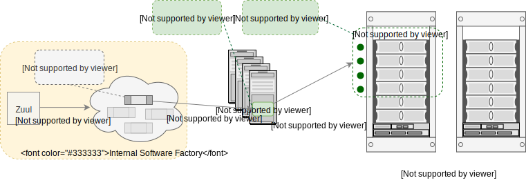

Baremetal jobs
==============

This section gives an overview and some details on the baremetal CI jobs. The
baremetal deployment is intended as a multinode real world "production-like"
environment for TripleO. - see `Baremetal deploy guide <baremetal_deploy_guide_>`_
for more information on setting up a baremetal environment.

The baremetal jobs, previously running in the RDO Phase 2 of the promotion
pipeline from Jenkins servers, now are triggered from an internal Software
Factory instance of Zuul. These promotion jobs testing containers built on
tripleo-ci-testing hashes run on real baremetal hardware, report to dlrn and
can be included in the TripleO promotion criteria.

The goal is to give developers feedback on real deployments and allow us to
have better coverage on issues seen in production environments. It also
allows an aproximation of OVB jobs running in RDO cloud in order to get an
"apples-to-apples" comparison to eliminate infra issues.

.. _baremetal_deploy_guide: https://docs.openstack.org/project-deploy-guide/tripleo-docs/latest/provisioning/index.html

Where
-----

The hardware is maintained internally and cannot be accessed by upstream
Zuul or RDO Cloud. The internal Software Factory instance provides a version
of infra upstream tools as Zuul, Gerrit and Nodepool for running the defined
baremetal jobs. Refer to `Software Factory Documentation <Software_Factory_documentation_>`_ for more details.

The jobs will use hardware_environments/<env name>/instackenv.json file and the
hardware_environments/<env name>/network_configs/single_nic_vlans settings file.
These configurations are explored in more detail below.

.. _Software_Factory_documentation: https://softwarefactory-project.io/docs/index.html

How
---

The baremetal job workflow is described as follows:

  1. The baremetal jobs are triggered in the periodic pipeline and initially
     run on a Nodepool node that can be called as "executor", where the job
     starts executing its playbooks and roles.

  2. The job ssh's to the baremetal machine which will host the undercloud vm
     and creates a new vm on which the undercloud will be installed and set
     up.

  3. Finally the undercloud VM deploys the overcloud on real baremetal nodes
     defined in the instackenv.json configuration over pxe boot.

This workflow for baremetal jobs is illustrated in the following figure:

Parenting from upstream and RDO repos
-------------------------------------

Jobs that run from internal Zuul can parent off, and use resources (jobs,
roles etc.) from, upstream (review.opendev.org) and RDO
(review.rdoproject.org) repos. As such, duplication can be kept to a minimum
and jobs that run internally on baremetal hardware can maintain parity with
OVB jobs run in RDO Cloud.

For example, a base TripleO CI job in Zuul ::

   - job:
      name: tripleo-ci-base-baremetal
      abstract: true
      description: |
         Base abstract job for Baremetal TripleO
      parent: tripleo-ci-base
      nodeset: tripleo-baremetal-centos-7-primary
      attempts: 1
      required-projects:
         - rdo-jobs
      roles:
         - zuul: rdo-jobs
      pre-run:
         - playbooks/configure-mirrors.yaml
         - playbooks/copy-env-vars-baremetal.yaml
      vars:
         # must be overridden
         undercloud: <undercloud>
         environment_infra: baremetal
         environment_type: baremetal
         playbooks:
         - baremetal-prep-virthost.yml
         - baremetal-full-undercloud.yml
         - baremetal-full-overcloud-prep.yml
         - baremetal-full-overcloud.yml
         - baremetal-full-overcloud-validate.yml
         tags:
         - all

Now adding the dlrn reporting ::

   - job:
      name: tripleo-ci-base-baremetal-dlrn
      parent: tripleo-ci-base-baremetal
      abstract: true
      description: |
         Base abstract job to do DLRN reporting
      required-projects:
         - config
      roles:
         - zuul: config
      pre-run:
         - playbooks/dlrn/pre-dlrn.yaml
      post-run:
         - playbooks/dlrn/post-dlrn.yaml
      secrets:
         - dlrnapi

Example of a specfic hardware job in Zuul:

Note that multiple jobs cannot be run on the hardware concurrently.
The base job is modified to include semaphore
https://zuul-ci.org/docs/zuul/user/config.html#semaphore to run
each only one at a time ::

   - job:
      name: tripleo-ci-base-baremetal-dlrn-my_env
      abstract: true
      parent: tripleo-ci-base-baremetal-dlrn
      vars:
         baremetal_env_vars: >-
           {{ local_working_dir }}/hardware_environments/my_env/<truncated_path>/env_settings.yml
         undercloud: <my_env-undercloud-baremetal-host-address>
      semaphore:
         name: my_env

   - job:
      name: periodic-tripleo-ci-centos-7-baremetal-3ctlr_1comp-featureset001-master
      parent: tripleo-ci-base-baremetal-dlrn-my_env
      vars:
         nodes: 3ctlr_1comp
         featureset: '001'
         release: master

Hardware Settings
-----------------

An example of hardware settings for baremetal environment 'my_env' is shown
below:

hardware_environments / my_env / network_configs / single_nic_vlans /
 env_settings.yml ::

   environment_type: my_env

   # undercloud.conf settings
   undercloud_network_cidr: 10.10.10.0/26
   undercloud_local_ip: 10.10.10.1/26
   undercloud_network_gateway: 10.10.10.100
   undercloud_undercloud_public_vip: 10.10.10.2
   undercloud_undercloud_admin_vip: 10.10.10.3
   undercloud_local_interface: eth1
   undercloud_masquerade_network: 10.10.10.0/26
   undercloud_dhcp_start: 10.10.10.5
   undercloud_dhcp_end: 10.10.10.24
   undercloud_inspection_iprange: 10.10.10.25,10.10.10.39
   undercloud_undercloud_nameservers: 10.10.10.200
   network_isolation_ipv4_cidr: 10.10.10.64/26
   undercloud_external_network_cidr: 10.10.10.64/26

   # undercloud vm settings
   virthost_provisioning_interface: eno2
   virthost_provisioning_ip: 10.10.10.4
   virthost_provisioning_netmask: 255.255.255.192
   virthost_provisioning_hwaddr: FF:FF:FF:FF:FF:FF
   virthost_ext_provision_interface: eno1

   undercloud_memory: 28672
   undercloud_disk: 80
   undercloud_vcpu: 8

   undercloud_instackenv_template: >-
     {{ local_working_dir }}/hardware_environments/my_env/instackenv.json

   undercloud_type: virtual
   step_introspect: true
   introspect: true

   # network-environment.yaml settings
   network_environment_args:
   InternalApiNetCidr: 172.21.33.0/24
   StorageNetCidr: 172.21.36.0/24
   StorageMgmtNetCidr: 172.21.35.0/24
   TenantNetCidr: 172.16.0.0/24
   ExternalNetCidr: 10.10.10.64/26
   BondInterfaceOvsOptions: "mode=4 lacp_rate=fast"
   InternalApiAllocationPools: [{'start': '172.21.33.10', 'end': '172.21.33.200'}]
   StorageAllocationPools: [{'start': '172.21.36.10', 'end': '172.21.36.200'}]
   StorageMgmtAllocationPools: [{'start': '172.21.35.10', 'end': '172.21.35.200'}]
   TenantAllocationPools: [{'start': '172.16.0.10', 'end': '172.16.0.200'}]
   # Leave room for floating IPs starting at .128
   ExternalAllocationPools: [{'start': '10.10.10.101', 'end': '10.10.10.120'}]
   ExternalInterfaceDefaultRoute: 10.10.10.130
   InternalApiNetworkVlanID: 1272
   StorageNetworkVlanID: 1273
   StorageMgmtNetworkVlanID: 1274
   ExternalNetworkVlanID: 113
   TenantNetworkVlanID: 1275
   NeutronExternalNetworkBridge: "''"
   PublicVirtualFixedIPs: [{"ip_address": "10.10.10.90"}]
   ControlPlaneSubnetCidr: "26"
   ControlPlaneDefaultRoute: 10.10.10.1
   EC2MetadataIp: 10.10.10.1
   DnsServers: ["8.8.8.8", "8.8.4.4"]
   NtpServer: ["216.239.35.12","time.google.com","0.north-america.pool.ntp.org"]

   step_root_device_size: false
   step_install_upstream_ipxe: false
   hw_env: my_env
   enable_vbmc: false

hardware_environments / my_env / instackenv.json ::

   {
   "nodes": [
      {
         "pm_password": "<passwd>",
         "pm_type": "ipmi",
         "mac": [
         "FF:FF:FF:FF:FF:FF"
         ],
         "cpu": "12",
         "memory": "32768",
         "disk": "558",
         "arch": "x86_64",
         "pm_user": "Administrator",
         "pm_addr": "10.1.1.11"
      },
      {
         "pm_password": "<passwd>",
         "pm_type": "ipmi",
         "mac": [
         "FF:FF:FF:FF:FF:FF"
         ],
         "cpu": "12",
         "memory": "32768",
         "disk": "558",
         "arch": "x86_64",
         "pm_user": "Administrator",
         "pm_addr": "10.1.1.12"
      },
      {
         "pm_password": "<passwd>",
         "pm_type": "ipmi",
         "mac": [
         "FF:FF:FF:FF:FF:FF"
         ],
         "cpu": "12",
         "memory": "32768",
         "disk": "558",
         "arch": "x86_64",
         "pm_user": "Administrator",
         "pm_addr": "10.1.1.13"
      },
      {
         "pm_password": "<passwd>",
         "pm_type": "ipmi",
         "mac": [
         "FF:FF:FF:FF:FF:FF"
         ],
         "cpu": "12",
         "memory": "32768",
         "disk": "558",
         "arch": "x86_64",
         "pm_user": "Administrator",
         "pm_addr": "10.1.1.14"
      }
   ]
   }

