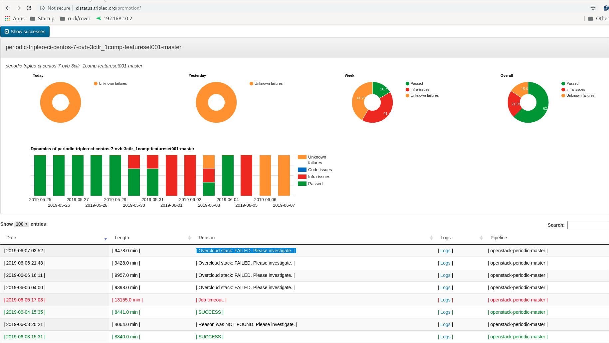
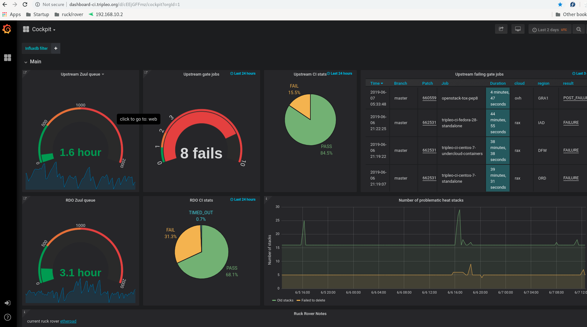
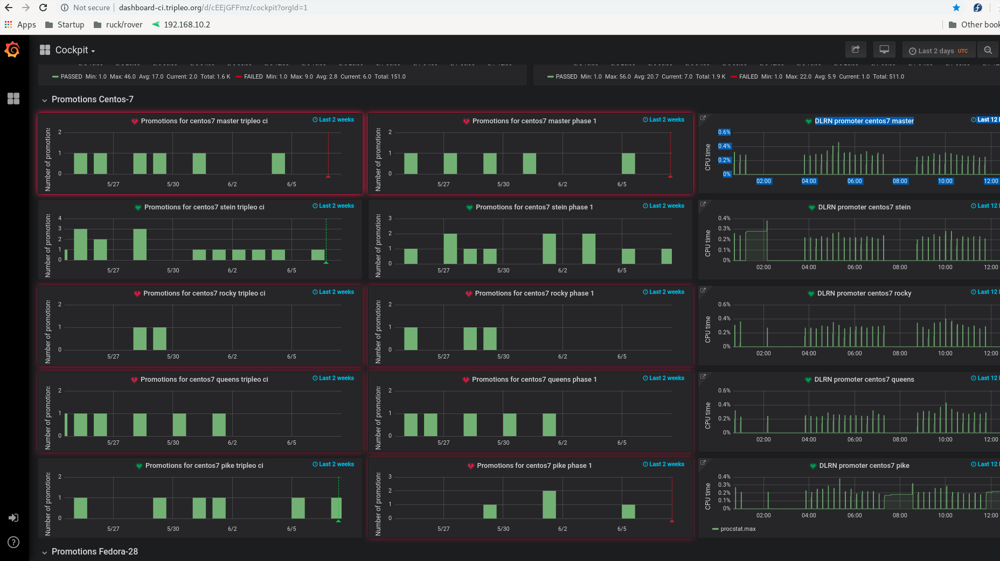
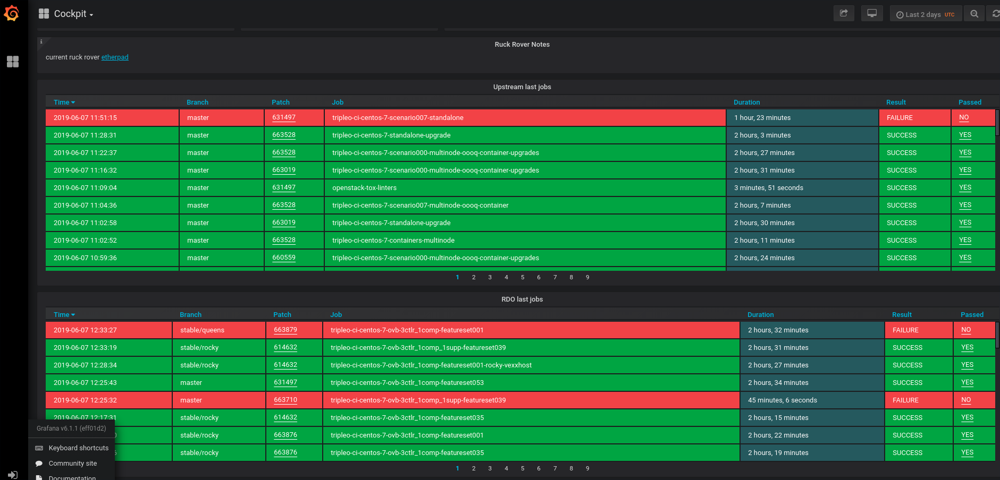

TripleO CI ruck|rover primer
============================

The tripleo-squad divides their work across 3 week sprints. During sprint
planning 2 members of the team are nominated as the 'ruck' and 'rover'.
You can easily identify these unfortunate souls in OFTC #oooq with "ruck" or
"rover" in their irc nick.

In short the "ruck" and "rover" are tasked with keeping the lights on for a
given TripleO CI sprint. This means:

* ensuring `gate queues`_ are green to keep TripleO patches merging.
* ensuring promotion_ jobs are green to keep TripleO up to date with
  the rest of OpenStack and everything else that isn't TripleO! Target
  is bugs filed + escalated + fixed for promotion at *least* once a week.

The "ruck|rover" concept adopted by Tripleo CI are taken from
`Australian Rules Football`_. The ruck monitors 'the queue' and files bugs,
and the rover picks up those bugs and runs with them until they're fixed.

This document is a primer for anyone new to the TripleO CI squad or otherwise
interested in how the ruck|rover of the TripleO CI squad operate. See the
`CI Team Structure`_ document for general information about how the (rest of
the) TripleO CI team is organised and operates in a given sprint.

Ruck
----

The ruck monitors the various jobs across the various tripleo related repos
both upstream tripleo-ci and rdo-infra jobs and periodics for promotions. The
grafana dashboard at
`http://cockpit-ci.tripleo.org/`_ is one of the
tools used by the ruck to monitor jobs (and many other things, more info on
grafana below).

Any new issues are triaged by collecting logs from multiple instances of the
error (i.e. same error in different jobs or different runs of the same job).
The ruck monitors the failing jobs and files bugs for all known or confirmed
things currently affecting TripleO CI.

Launchpad is used as the bug tracker - here is a list of recently created
`Tripleo launchpad bugs`_. When filing a new bug, the ruck will add the
appropriate tag(s):

* ci: a general tag for all ci related bugs - any bug about a failing CI job
  should have this.
* alert: critical bugs e.g. something that affects a great number of jobs. This
  tag causes the bug to be advertised in irc OFTC #tripleo.
* tempest: bug is tempest related - failing tests or other tempest related error.
* ci-reproducer: related to the `zuul based job reproducer`_
* promotion-blocker: this is used when the failing job(s)  is in the promotion
  criteria (more on that below).

For the periodic promotion jobs the ruck must ensure that the jobs defined as
being in 'promotion criteria' are passing. The criteria is simply a list of
jobs which must pass for a promotion to occur (see the promotion_
docs for more info on the promotion stages in TripleO). This list is maintained
in a file per branch in the ci-config-dlrnapi-promoter-config_ directory.
For tripleo-ci promotions we are interested in promotions from current to
current-tripleo (see promotion_). Thus, looking at master.ini_ at time of
writing for example::

  [current-tripleo]
  periodic-singlenode-featuresetcontainers-build
  periodic-tripleo-ci-centos-7-ovb-3ctlr_1comp-featureset001-master
  periodic-tripleo-ci-centos-7-ovb-1ctlr_1comp-featureset002-master-upload
  periodic-tripleo-ci-centos-7-multinode-1ctlr-featureset010-master
  periodic-tripleo-ci-centos-7-scenario001-standalone-master
  ...

The above means that for a promotion to happen all the jobs defined under
"current-tripleo" must pass. Obviously this list changes over time as jobs
are created and retired. It is sometimes necessary to temporarily skip a job
from that list (which is why you may see some jobs commented out with #).

Rover
-----
The rover then takes the bugs filed by the ruck and tries to fix them. That is
*not* to say that the rover is expected or indeed able to fix all encountered
things! Really the expectation is that the rover has a root cause, or at least
understands where the bug is coming from (e.g. which service).

In some cases bugs are fixed once a new version of some service is released
(and in tripleo-ci jobs after a promotion_ if it is a non tripleo
service/project). In this case the rover is expected to know what that fix is
and do everything they can to make it available in the jobs. This will range
from posting gerrit reviews to bump some service version in requirements.txt
through to simply harrassing the 'right folks' ;) in the relevant `TripleO Squad`_.

In other cases bugs may be deprioritized - for example if the job is non voting
or is not in the promotion criteria then any related bugs are less likely to
be getting the rover's attention. If you are interested in such jobs or bugs
then you should go to #OFTC oooq channel and find the folks with "ruck" or
"rover" in their nick and harrass them about it!

Of course for other cases there are bona fide bugs with the `TripleO CI code`_
that the rover is expected to fix. To avoid being overwhelmed time management
is hugely important for the rover especially under high load. As a general rule
the rover should not spend any more than half a day (or four hours) on any
particular bug. Once this threshold is passed the rover should reach out and
escalate to any component experts.

Under lighter load the rover is encouraged to help with any open bugs perhaps
those ongoing issues with lower priority (e.g. non-voting jobs) and even non
CI bugs in TripleO or any other relevant OpenStack component.

Tools
-----

The TripleO squad has developed two main tools to help the ruck and rover
do their job efficiently. They are known within the squad as 'grafana' and
'sova' (the names of the underlying code in each case):

* grafana: `http://cockpit-ci.tripleo.org/`_
* sova: `http://cistatus.tripleo.org/`_
* etherpad: $varies

The ruck|rover are encouraged to use an etherpad that is kept up to date for
any ongoing issues actively being worked on. Besides allowing coordination
between ruck and rover themselves (the TripleO CI team is distributed across
a number of time zones) one other use case is to allow  tripleo-devs to check
if the reason a particular job is failing on their code review is 'known' or if
they need to go harrass the ruck|rover about it in OFTC #oooq. The location
of the current ruck|rover etherpad is given in grafana (see below).

Sova
^^^^

In sova you can see for each of "check", "gate", and "promotions" a list of all
jobs, grouped by functionality ('ovb' or 'containers') as well as by branch in
the case of promotion jobs. By clicking on a particular job you can see the
most recent failures and successes with link to logs for more investigation.
Sova tries to determine where and how the a job fails and reports that
accordingly as shown below.

Grafana
^^^^^^^

Grafana is used to track many things and is also constantly evolving so we
highlight only a few main data points here. The top of the dashboard has some
meters showing the overall 'health' of CI.

   As can be seen left to right - the "Upstream Zuul queue" gives the time a
   review waits before being picked up by zuul for jobs to run against it, the
   "Upstream gate jobs" shows the number of failing gate jobs in the last 24 hours,
   "Upstream CI stats" shows the ratio of passing to failing jobs as a Pie chart
   (anything above 80% pass is good) and finally a list of the latest failing gate
   jobs with links. At the bottom left there is a link to the current ruck rover
   etherpad.

Grafana is also useful for tracking promotions across branches.

   As seen above on the left hand side and from top to bottom - the latest
   promotions for master, stein, rocky, queens and pike as bar charts. The bars
   represent promotions and height shows the number of promotions on that day.

Finally grafana tracks a list of all running jobs hilighting the failures in
red.

.. _`gate queues`: https://docs.openstack.org/tripleo-docs/latest/ci/ci_primer.html
.. _`Australian Rules Football`: https://en.wikipedia.org/wiki/Follower_(Australian_rules_football)
.. _promotion: https://docs.openstack.org/tripleo-docs/latest/ci/stages-overview.html
.. _`TripleO Squad`: https://docs.openstack.org/tripleo-docs/latest/contributor/index.html#squads
.. _`TripleO launchpad bugs`: https://bugs.launchpad.net/tripleo/+bugs?orderby=-datecreated&start=0
.. _ci-config-dlrnapi-promoter-config: https://github.com/rdo-infra/ci-config/blob/master/ci-scripts/dlrnapi_promoter/config/CentOS-7/
.. _master.ini: https://github.com/rdo-infra/ci-config/blob/7e8c40e2b2b686cc2d1d3e86cf8f9cbbd646a1c3/ci-scripts/dlrnapi_promoter/config/CentOS-7/master.ini#L16-L43
.. _`http://cockpit-ci.tripleo.org/`: http://cockpit-ci.tripleo.org/
.. _`http://cistatus.tripleo.org/`: http://cistatus.tripleo.org/
.. _`CI Team Structure`: https://specs.openstack.org/openstack/tripleo-specs/specs/policy/ci-team-structure.html
.. _`zuul based job reproducer`: https://opendev.org/openstack/tripleo-quickstart-extras/src/branch/master/roles/create-zuul-based-reproducer/README.md
.. _`TripleO CI code`: https://opendev.org/openstack/tripleo-ci/src/branch/master/README.rst

