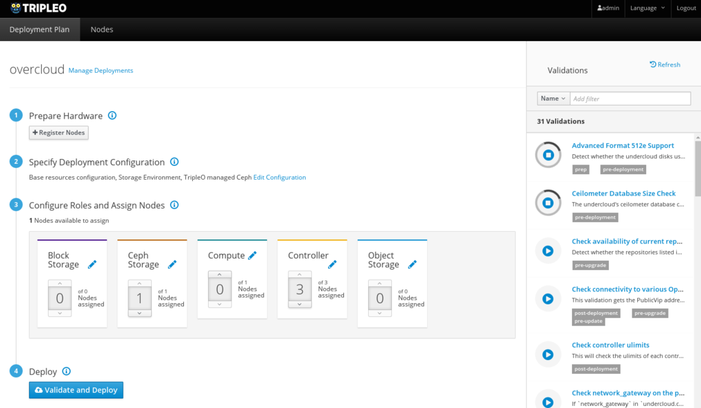

.. _basic-deployment-ui:

(DEPRECATED) Basic Deployment (UI)
==================================

.. note:: The tripleo-ui is no longer available as of Stein. This documentation
   is deprecated.

This document will show you how to access the |project| UI and perform
a simple deployment with some customizations. Validations are
automatically run at every step to help uncover potential issues early.

Prepare Your Environment
------------------------

The UI is installed by default with the undercloud. You can confirm
this by opening ``undercloud.conf`` and checking for::

  enable_ui = true
  enable_validations = true

The validations are optional but strongly recommended.

#. Make sure you have your environment ready and undercloud running:

   * `Environment Setup <environment_setup_deploy_guide_>`_
   * `Undercloud Installation <undercloud_installation_deploy_guide_>`_

.. _environment_setup_deploy_guide: https://docs.openstack.org/project-deploy-guide/tripleo-docs/latest/environments/index.html
.. _undercloud_installation_deploy_guide: https://docs.openstack.org/project-deploy-guide/tripleo-docs/latest/deployment/install_undercloud.html

#. Make sure the images are uploaded in Glance on the undercloud:

   * `Get Images <get_images_deploy_guide_>`_
   * `Upload Images <upload_images_deploy_guide_>`_

.. _get_images_deploy_guide: https://docs.openstack.org/project-deploy-guide/tripleo-docs/latest/deployment/install_overcloud.html#get-images
.. _upload_images_deploy_guide: https://docs.openstack.org/project-deploy-guide/tripleo-docs/latest/deployment/install_overcloud.html#upload-images

Access the UI
-------------

The UI is accessible on the undercloud URL. With the default settings
the URLs may look like the following, depending on whether the
undercloud was set up with `SSL <undercloud_ssl_>`_:

.. _undercloud_ssl: https://docs.openstack.org/project-deploy-guide/tripleo-docs/latest/features/ssl.html#undercloud-ssl

* http://192.168.24.1:3000 if it was not
* https://192.168.24.2 if set up with SSL

The username is ``admin`` and the password can be obtained by running
the following command on the undercloud::

  $ sudo hiera keystone::admin_password

.. note:: On an undercloud deployed without SSL, the UI and API
   endpoints are deployed on the control plane which may not be
   routable. In this case you will need to create a tunnel or use a
   tool such as sshuttle to be able to use the UI from a local
   browser::

     sshuttle -r user@undercloud 192.168.24.0/24

.. admonition:: Virtual
   :class: virtual

   If you cannot directly access the undercloud (for example because
   the undercloud is installed in a VM on a remote lab host), you will
   need to create a tunnel and make some configuration changes in order
   to access the UI locally.

   #. Open the tunnel from the virt host, to the undercloud::

       ssh -Nf user@undercloud -L 0.0.0.0:443:192.168.24.2:443 # If SSL
       ssh -Nf user@undercloud -L 0.0.0.0:3000:192.168.24.1:3000 # If no SSL

      .. note:: Quickstart started creating the tunnel automatically
         during Pike. If using an older version you will have to create
         the tunnel manually, for example::

          ssh -F /root/.quickstart/ssh.config.ansible undercloud -L 0.0.0.0:443:192.168.24.2:443

   #. Edit the UI config on the undercloud to replace the undercloud IP
      with your virt host name, for example::

          sudo sed -i.bak s/192.168.24.2/virthost/ /var/www/openstack-tripleo-ui/dist/tripleo_ui_config.js

      Additionally, make sure all the API endpoints are commented out
      in this file.

      .. note:: Changes to ``tripleo_ui_config.js`` are overwritten on
         undercloud upgrades.

   #. You may have to open port 3000 or 443 on your virt host.

      .. admonition:: Stable Branch
         :class: stable

         .. admonition:: Newton
            :class: newton

            Starting in Ocata, all the API ports are proxied through
            3000 (non-SSL) or 443 (SSL). If using Newton, you will need
            to ensure ports for all the API endpoints specified in
            ``tripleo_ui_config.js`` are open and accessible. If using
            SSL with self-signed certificates, Firefox will also
            require a SSL certificate exception to be accepted for
            every port.

   #. The UI should now be accessible at http://virthost:3000 or
      https://virthost.

Manage Plans
------------

A default plan named ``overcloud`` is created during the undercloud
installation, based on the default tripleo-heat-templates installed on
the system. This plan can be customized and deployed.

It is also possible to create and manage additional plans in parallel,
in order to test different configurations.

By clicking on "Manage Deployments" beside the deployment name, you can
perform actions on plans such as create, export, delete, etc.

.. note::

   There can be confusion with node assignments when switching between
   plans, particularly in previous releases like Newton. If doing work
   with multiple plans, ensure the Node counts are what you expect
   before starting the deployment, for example by navigating to Edit
   Configuration -> Parameters.

Manage Nodes
------------

Register Nodes
^^^^^^^^^^^^^^

Navigate to the **Nodes** tab in the top bar and click on the
*Register Nodes* button. New nodes can be added in two ways:

  * Importing an `instackenv.json <instackenv_file_>`_ file

.. _instackenv_file: https://docs.openstack.org/project-deploy-guide/tripleo-docs/latest/environments/baremetal.html#instackenv-json

* Importing an instackenv.json file
* Manually defining nodes via the *Add New* button.

Introspect Nodes
^^^^^^^^^^^^^^^^

Introspection is a required step when deploying from the UI. Once the
nodes are registered and in the ``manageable`` provision state, select
the nodes and click on the *Introspect Nodes* button.

Provide Nodes
^^^^^^^^^^^^^

Once introspection is completed, nodes need to be "provided" in order
to move to the ``available`` state and be available for
deployments. Select the nodes and click on the *Provide Nodes* button.

.. note:: For more information about node states, see `Node States <node_states_>`_.

.. _node_states: https://docs.openstack.org/project-deploy-guide/tripleo-docs/latest/provisioning/node_states.html

Tag Nodes
^^^^^^^^^

Nodes need to be tagged to match a specific profile/role before they
can be used in a deployment. Select the nodes you want to assign a
profile to, then click on *Tag Nodes* (the option may be in a dropdown
menu).

.. admonition:: Stable Branch
   :class: stable

   In Newton and Ocata, node assignment and node tagging are done at
   the same time when assigning nodes on the **Deployment Plan** page.

Configure the Deployment
------------------------

On the **Deployment Plan** tab, you can configure both the overall
deployment, as well as specific roles.

Clicking on the *Edit Configuration* link displays the list of
environments available and their description, based on the templates
provided in the plan. After enabling environments as desired, click on
*Save Changes* and navigate to the **Parameters** tab. Once saved, the
enabled environments will also be configurable on this tab.

The **Parameters** tab lets you set configuration options for the
deployment in general, as well as for each individual environment.

.. admonition:: Stable Branch
   :class: stable

   .. admonition:: Newton
      :class: newton

      In Newton it was not possible to configure individual
      environments. The environment templates should be updated
      directly with the required parameters before uploading a new
      plan.

Individual roles can also be configured by clicking on the Pencil icon
beside the role name on each card.

.. admonition:: Stable Branch
   :class: stable

   .. admonition:: Newton
      :class: newton

      In Newton, you may need to assign at least one node to the role
      before the related configuration options are loaded.

Assign Nodes
------------

The second number on each card indicates the number of nodes tagged
with this particular profile. The number of nodes manually assigned via
the number picker will be deployed.

.. admonition:: Stable Branch
   :class: stable

   In Newton and Ocata, nodes are tagged as part of assigning a node to
   a profile. This can cause issues when switching deployment plans, as
   the node counts displayed on the card may not match the value
   actually stored in the plan. You can correct this by clicking on
   Edit Configuration -> Parameters and checking/updating the node
   counts for ControllerCount, ComputeCount, etc.

   Additionally, when using custom roles you should make sure to
   unassign the nodes associated with these roles before deleting the
   plan, as the role cards are displayed based on the roles in the
   current plan only. Therefore it is not possible to unassign a node
   which is associated with a role that does not exist in the current
   plan.

Deploy the Overcloud
--------------------

Click on the *Deploy* button.

You may see a warning if not all validations passed. While this is
expected in resources-constrained virtual environments, it is
recommended to check the failed validations carefully before
proceeding.

The ``View detailed information`` link shows the details for all the
Heat resources being deployed.

Post-Deployment
---------------

Once the deployment completes, the progress bar will be replaced with
information about the overcloud such as the IP address and login
credentials.

If the deployment failed, information about the failure will be
displayed.

.. admonition:: Virtual
   :class: virtual

   To access the overcloud, you will need to update your tunnel in
   order to access the new URL. For example, if your overcloud
   information is as such::

     Overcloud IP address: 192.168.24.12
     Username: admin
     Password: zzzzzz

   Assuming you deployed the overcloud with SSL enabled, you could
   create the following tunnel from your virt host to the undercloud::

     ssh -Nf user@undercloud -L 0.0.0.0:1234:192.168.24.12:443

   After opening port 1234 on your virt host, you should be able to
   access the overcloud by navigating to https://virthost:1234.
